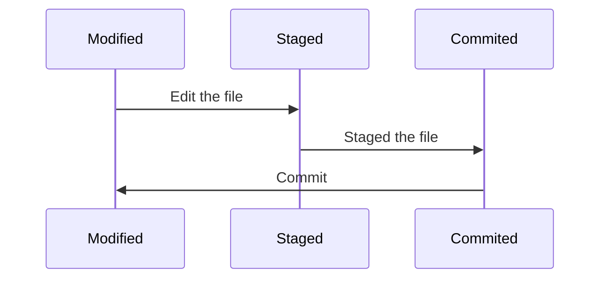
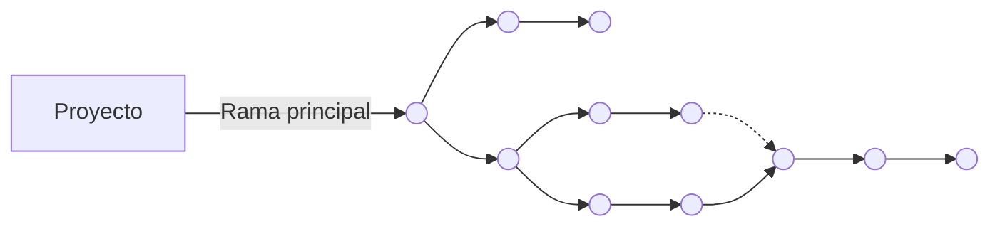

# Curso de GIT

<details><summary> <b> Clase 1 </b></summary>

## ¿Qué es Git?

> Git es un sistema de control de versiones, donde los cambios en el código son registrados por un historial en sus ficheros para saber quién y cuándo lo hizo.

<details><summary> :eyes: <b> Configurar el entorno</b></summary>

1. Cambiar los credenciales **globales**:

    ```sh
    git config --global user.name <tu_nombre>
	git config --global user.email <tu_email>
    ```

2. Cambiar credenciales **para un proyecto en concreto**:
    ```sh
    cd <tu_directorio>
    git config user.name <tu_nombre>
    git config user.email <tu_email>
    ```
    
3. Editor de código que se abre con Git:

    ```sh
    git config core.editor "code"
    ```
    > [!NOTE]\
    > En este caso se utiliza con **Visual Studio Code** pero se puede modificar a "atom", "subl", "nano",etc

4. Comprobar configuración de Git	:

    ```sh
    git config --list
    ```

</details>

## Ventajas

<div style="display:flex; justify-content: space-between; align-items: center;">
    
    
    
</div>

## Git posee 3 tipos de estados:
 
1.  **Modified:** Cuando un archivo tiene cambios marcados para ser confirmados y se encuentra en el directorio de trabajo.

2.  **Staged:** Los archivos modificados ya están marcados para ser confirmados en el repositorio local.

3.  **Commited:** Se crea un punto de guardado en el repositorio.



</details>

<details><summary> <b> Clase 2 </b></summary>

## Conceptos Principales

>El propósito principal de las ramas es el trabajo colaborativo en paralelo.

1. **Rama (Branch)**: una versión paralela del proyecto que se utiliza para desarrollar nuevas características o corregir errores sin afectar la rama principal.
2. **Rama principal (Main Branch)**: la rama predeterminada del proyecto, usualmente llamada "master".
3. **Rama de características (Feature Branch)**: una rama que se utiliza para desarrollar una nueva característica o funcionalidad.
4. **Rama de corrección (Hotfix Branch)**: una rama que se utiliza para corregir un error crítico en la rama principal.

## Flujo de trabajo

Crear una rama de características o corrección a partir de la rama principal.
Realizar cambios y commits en la rama creada.
Fusionar la rama creada con la rama principal cuando se complete el desarrollo.
Eliminar la rama creada una vez fusionada.

<details><summary><b> Ver Imagen</b></summary>
	

</details>

>Permite trabajar en diferentes versiones del proyecto de forma paralela.
Facilita la colaboración entre desarrolladores.
Permite revertir cambios si algo sale mal.

>Las ramas de Git son una herramienta poderosa para gestionar diferentes versiones de un proyecto. Al entender cómo crear, cambiar, fusionar y eliminar ramas, los desarrolladores pueden trabajar de forma más eficiente y colaborativa en proyectos complejos.
</details>

<details><summary> <b> Clase 3 </b></summary>
	
## GitHub


## Navegando por GitHub
>Se puede:
1. **Ver mi perfil y mis repositorio**: Podemos ver nuestra información de nuestro perfil, repositorios, organizaciones a las que pertenecemos y ver nuestras contribuciones.
2. **Buscar perfiles, repositorios , etc.**: Podemos ver nuestros repositorios y repositorios de otras personas.
3. **Proyectos**: Nos permite ver, crear y gestionar proyectos.
4. **Organizaciones**: Nos permite crear repositorios privados y poder agregar personas a este.
5. **Repositorios y codigo**: Podemos ver archivos de los repositorios publicos y personales, se puede realizar cambios en el código.
6. **Acciones en los repositorios**: Las actions nos permiten automatizar las tareas en nuetro repositorio.
   
## Repositorio remoto:
>Para esto necesitamos:
- **Crear una cuenta en GitHub**
- **Crear un repositorio local en nuestro ordenador.**
- **Vincular el repositorio local con el repositorio remoto en GitHub**
- **Sicronizar nuestros cambios del repositorio local con el repositorio remoto**


## Comandos

| Comando                     | Descripción                                                                |
| -------------------------   | -----------------------------------------------------------------          |
| `git init <nuevo_proyecto>` | Inicia un nuevo repositorio Git.                                           |
| `git status`                | Muestra el estado actual del proyecto.                                     |
| `git add`                   | Agrega todos los archivos al repositorio de Git.                           |
| `git restore --staged`      | Evita que los cambios en el área de preparación se incluyan en el commit.  |
| `git commit`                | Genera un registro del cambio realizado.                                   |
| `git log`                   | Muestra un historial de los commits realizados.                            |
| `git commit -amend-m`       | Permite editar el mensaje del commit.                                      |
| `git branch `               | Nos muestra todas las ramas del repositorio actual.                        |
| `git branch <nombre_rama>`  | Crear una rama este tiene diferentes complementos.                         |
| `git switch <nombre_rama>`  | Permite cambiar de una rama a otra en nuestro repositorio loca.            |
| `git checkout <nombre_rama>`| Cambia la ubicación actual al "nombre_rama" con todos los cambios.         |
| `git branch -a`             | Permite ver a las ramas locales y remotas.                                 |
| `git merge <nombre_rama>`   | Fusiona una rama.				                           |
| `git remote add <alias> <URL-repositorio-remoto>`| Enlaza nuestro repositorio local con nuestro repositorio remoto.|
| `git push <alias> main`     | Sicroniza nuestros cambios de mi repositorio local con mi repositorio remoto.|


