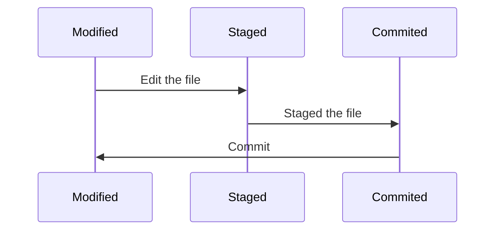

# Curso de GIT

<details><summary> <b> Clase 1 </b></summary>

## ¿Qué es Git?

> Git es un sistema de control de versiones, donde los cambios en el código son registrados por un historial en sus ficheros para saber quién y cuándo lo hizo.

<details><summary> :eyes: <b> Configurar el entorno</b></summary>

1. Cambiar los credenciales **globales**:

    ```sh
    git config --global user.name <tu_nombre>
	git config --global user.email <tu_email>
    ```

2. Cambiar credenciales **para un proyecto en concreto**:
    ```sh
    cd <tu_directorio>
    git config user.name <tu_nombre>
    git config user.email <tu_email>
    ```
    
3. Editor de código que se abre con Git:

    ```sh
    git config core.editor "code"
    ```
    > [!NOTE]\
    > En este caso se utiliza con **Visual Studio Code** pero se puede modificar a "atom", "subl", "nano",etc

4. Comprobar configuración de Git	:

    ```sh
    git config --list
    ```

</details>

## Ventajas

<div style="display:flex; justify-content: space-between; align-items: center;">
    
    
    
</div>

## Git posee 3 tipos de estados:
 
1.  **Modified:** Cuando un archivo tiene cambios marcados para ser confirmados y se encuentra en el directorio de trabajo.

2.  **Staged:** Los archivos modificados ya están marcados para ser confirmados en el repositorio local.

3.  **Commited:** Se crea un punto de guardado en el repositorio.



</details>

## Comandos

| Comando                     | Descripción                                                                |
| -------------------------   | -----------------------------------------------------------------          |
| `git init <nuevo_proyecto>` | Inicia un nuevo repositorio Git.                                           |
| `git status`                | Muestra el estado actual del proyecto.                                     |
| `git add`                   | Agrega todos los archivos al repositorio de Git.                           |
| `git restore --staged`      | Evita que los cambios en el área de preparación se incluyan en el commit.  |
| `git commit`                | Genera un registro del cambio realizado.                                   |
| `git log`                   | Muestra un historial de los commits realizados.                            |
