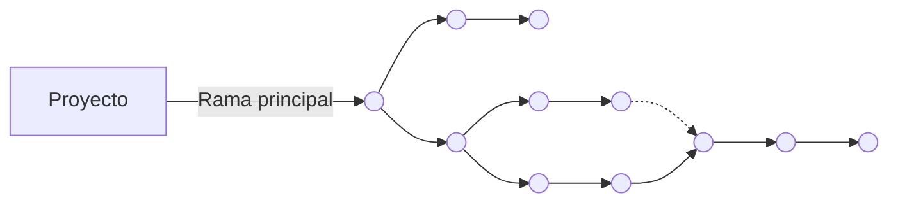

# Curso de GIT

<details><summary> <b> Clase 1 </b></summary>

## ¿Qué es Git?

> Git es un sistema de control de versiones, donde los cambios en el código son registrados por un historial en sus ficheros para saber quién y cuándo lo hizo.

<details><summary> :eyes: <b> Configurar el entorno</b></summary>

1. Cambiar los credenciales **globales**:

    ```sh
    git config --global user.name <tu_nombre>
	git config --global user.email <tu_email>
    ```

2. Cambiar credenciales **para un proyecto en concreto**:
    ```sh
    cd <tu_directorio>
    git config user.name <tu_nombre>
    git config user.email <tu_email>
    ```
    
3. Editor de código que se abre con Git:

    ```sh
    git config core.editor "code"
    ```
    > [!NOTE]\
    > En este caso se utiliza con **Visual Studio Code** pero se puede modificar a "atom", "subl", "nano",etc

4. Comprobar configuración de Git	:

    ```sh
    git config --list
    ```

</details>

## Ventajas

<div style="display:flex; justify-content: space-between; align-items: center;">
    
    
    
</div>

## Git posee 3 tipos de estados:
 
1.  **Modified:** Cuando un archivo tiene cambios marcados para ser confirmados y se encuentra en el directorio de trabajo.

2.  **Staged:** Los archivos modificados ya están marcados para ser confirmados en el repositorio local.

3.  **Commited:** Se crea un punto de guardado en el repositorio.


</details>

<details><summary> <b> Clase 2 </b></summary>

## Conceptos Principales

>El propósito principal de las ramas es el trabajo colaborativo en paralelo.

1. **Rama (Branch)**: una versión paralela del proyecto que se utiliza para desarrollar nuevas características o corregir errores sin afectar la rama principal.
2. **Rama principal (Main Branch)**: la rama predeterminada del proyecto, usualmente llamada "master".
3. **Rama de características (Feature Branch)**: una rama que se utiliza para desarrollar una nueva característica o funcionalidad.
4. **Rama de corrección (Hotfix Branch)**: una rama que se utiliza para corregir un error crítico en la rama principal.

## Flujo de trabajo

Crear una rama de características o corrección a partir de la rama principal.
Realizar cambios y commits en la rama creada.
Fusionar la rama creada con la rama principal cuando se complete el desarrollo.
Eliminar la rama creada una vez fusionada.

<details><summary><b> Ver Imagen</b></summary>
	

</details>

>Permite trabajar en diferentes versiones del proyecto de forma paralela.
Facilita la colaboración entre desarrolladores.
Permite revertir cambios si algo sale mal.

>Las ramas de Git son una herramienta poderosa para gestionar diferentes versiones de un proyecto. Al entender cómo crear, cambiar, fusionar y eliminar ramas, los desarrolladores pueden trabajar de forma más eficiente y colaborativa en proyectos complejos.
</details>

<details><summary> <b> Clase 3 </b></summary>
	
## GitHub

## Navegando por GitHub
>Se puede:
1. **Ver mi perfil y mis repositorio**: Podemos ver nuestra información de nuestro perfil, repositorios, organizaciones a las que pertenecemos y ver nuestras contribuciones.
2. **Buscar perfiles, repositorios , etc.**: Podemos ver nuestros repositorios y repositorios de otras personas.
3. **Proyectos**: Nos permite ver, crear y gestionar proyectos.
4. **Organizaciones**: Nos permite crear repositorios privados y poder agregar personas a este.
5. **Repositorios y codigo**: Podemos ver archivos de los repositorios publicos y personales, se puede realizar cambios en el código.
6. **Acciones en los repositorios**: Las actions nos permiten automatizar las tareas en nuetro repositorio.
   
## Repositorio remoto:
>Para esto necesitamos:
- **Crear una cuenta en GitHub**
- **Crear un repositorio local en nuestro ordenador.**
- **Vincular el repositorio local con el repositorio remoto en GitHub**
- **Sicronizar nuestros cambios del repositorio local con el repositorio remoto**

</details>

<details><summary> <b> Clase 4 </b></summary>
	
## Push, pull y pull request

## ¿Que es git push?

> Es un comando que nos permite subir los cambios de nuestro repositorio local a nuestro repositorio remoto.
> Este se asocia a solo una rama.

## ¿Que es git pull?

> Es un comando que nos permite descargar los cambios de nuestro repositorio remoto a nuestro repositorio local.

## Malas prácticas del git push 

> El git push -f ó git force push, es una mala práctica porque puede sobreescribir los cambios de otros usuarios en el repositorio remoto.

## Como crear un pull request o PR

> Un pull request es una solicitud de revision y fusión de los cambios de una rama en otra rama que son enviados al repositorio original.
> Un pull request se puede crear desde la plataforma de GitHub o desde la linea de comandos de git.
> Se puede hacer pull request con commits pequeños y poder visualizarlos, esto cuenta como una buena práctica.

</details>

<details><summary> <b> Clase 5 </b></summary>

## Git flow

>Es un flujo de trabajo ramificado que utiliza varias ramas.


>Ramas principales
- **main o master**: Es la rama principal que contiene el código de producción.
- **develop**: Esta rama de desarrollo donde se realizan los cambios principales.
- **features**: Estos son caracteristicas nuevas del proyecto.
- **release**: Estos son cambios de último momento.
- **Hotflix**: Son parches o arreglar bugs pequeños que son parte del main.

## GitHub flow

>Es un flujo de trabajo de git mas simple, porque solo utiliza dos ramas.


>Estas son:
- **main**: Es la rama principal que contiene el código estable.
- **feature**: Esta rama es para desarrollar nuevas caracteristicas.

## Trunk Based Development
>Es una estrategia donde se prioriza hacer commits desde la rama principal, en caso de necesitar ramas se hacen PR pequeños para integrarlos lo antes posible.

## Ship/ Show / Ask

- **Ship**: Son los cambios listos para fusionarse con la rama principal.
- **Show**: Son los cambios que deben ser revisados po CI antes de fusionarse con la rama principal.
- **Ask** : Son los cambios que requieren de una PR, antes de ser fusionados.

</details>

<details><summary> <b> Clase 6 </b></summary>
	
## Buenas prácticas

## Commits
## ¿Cada cuánto hacer un commit?
>Los commits deben ser pequeños agrupando pequeñas mejoras o acciones.

## ¿Como escribir un buen commit?
>Se debe usar un verbo imperativo.Por ejemplo: "Add", "Feat", etc.
>No se debe usar puntos suspensivos o punto final.
>El commit debe tener como máximo 50 caracteres.
>El commit debe ser claro y especifico.
>Se debe usar un prefijo para los commits y que estos sean más semánticos.

## Ejemplo

feat: add new search feature
^--^  ^--------------------^
│     │
│     └--> # Descripción de los cambios
│
└──------> # Tipo del cambio

## Prefijos para los commits

- **feat**: Nueva característica para el usuario.
- **fix** : Es cuando se arregla un bug que afecta al usuario..
- **perf**: Es para cambios que mejoran el rendimiento del sitio. 
- **build**: Es para cambios en el sistema de build, tareas de despliegue o instalación.
- **ci** : Es para cambios en la integración continua.
- **docs** : Es para cambios en la documentación.
- - **refactor**: Es para la refactorización del código como cambios de nombre de variables o funciones.
- **style** : Es para cambios de formato, tabulaciones, espacios o puntos y coma, etc; no afectan al usuario.
- **test** : Este añade tests o refactoriza uno existente.
  
## Ramas
## ¿Como elegir un buen nombre para mi rama?
>Para elegir un buen nombre de la rama, es recomendable usar el nombre de la accion que se va a realizar en la rama.

</details>

<details><summary> <b> Clase 7 </b></summary>
	
## ¿Cuándo deshacer cambios?

>Cuando el proyecto deja de funcionar.
>Para recuperar código eliminado.
>Para recuperar archivos eliminados.

## ¿Qué comando debo usar para deshacer un cambio que hice en un archivo?

>Esto depende de si desea deshacer el cambio en todo el commit o solo en el archivo.
>Si desea deshacer el cambio en todo el commit, use git reset soft <commit_id>.
>Si desea deshacer el cambio solo en el archivo, use git checkout -- <commit_id> <archivo> && git checkout HEAD -- <archivo>.

## Comandos destructivos y no destructivos

## Comandos destructivos

>Estos afectan el historial de commits realizados.

>Entre estos tenemos:

- **git rebase**
- **git commit amend**
- **git reset**
- **git push --force**

## Comandos no destructivos
>Trabajan en base al historial sin afectarlo.
>Entre estos tenemos:

- **git checkout**
  
</details>

<details><summary> <b> Clase 8 </b></summary>
	
## ¿Qué son los Hooks?
>Los Hooks son scripts que se ejecutan automáticamente antes o después de que ocurra un evento específico en Git.
>Estos eventos pueden ser: commits, pushes, entre otros.
>Estos permiten automatizar tareas repetitivas, como enviar notificaciones por Slack o ejecutar pruebas unitarias.

>Existen dos:
- **Hooks del lado del cliente**
  >Afectan solo al repositorio local que los contiene.
  >Pueden ser:
  >-**Pre-commit**: Se ejecuta antes de que se realice un commit. Se puede utilizar para verificar que el código cumpla con ciertos estándares o para ejecutar pruebas unitarias.
  >-**Post-commit**: Se ejecuta después de que se realiza un commit. Se puede utilizar para enviar notificaciones por Slack o para actualizar automáticamente la documentación.
  >-**Pre-push**: Se ejecuta antes de que se envíe un push al repositorio remoto. Se puede utilizar para verificar que no se estén enviando cambios no deseados.
  >-**Post-push**: Se ejecuta después de que se envía un push al repositorio remoto. Se puede utilizar para actualizar automáticamente la rama de producción o para enviar notificaciones a otros desarrolladores.
  >-**Post-checkout-Post-merge**: Permite limpiar un directorio de trabajo, tras realizar un checkout.
- **Hooks del lado del servidor**
  >Pueden ser:
  >-**Pre-receive**: Comprueba los commits que se quieran guardar.
  >-**update**: Es cuando llega ese git push y haces comprobaciones.
  >-**post-receive**: Es cuando el push ya sea ha sincronizado y haces acciones. 
  
## ¿Qué son los Alias?
>Son atajos que permiten personalizar los comandos de Git.


 </details>
 
## Comandos

| Comando                     | Descripción                                                                |
| -------------------------   | -----------------------------------------------------------------          |
| `git init <nuevo_proyecto>` | Inicia un nuevo repositorio Git.                                           |
| `git status`                | Muestra el estado actual del proyecto.                                     |
| `git add`                   | Agrega todos los archivos al repositorio de Git.                           |
| `git restore --staged`      | Evita que los cambios en el área de preparación se incluyan en el commit.  |
| `git commit`                | Genera un registro del cambio realizado.                                   |
| `git log`                   | Muestra un historial de los commits realizados.                            |
| `git commit -amend-m`       | Permite editar el mensaje del commit.                                      |
| `git branch `               | Nos muestra todas las ramas del repositorio actual.                        |
| `git branch <nombre_rama>`  | Crear una rama este tiene diferentes complementos.                         |
| `git switch <nombre_rama>`  | Permite cambiar de una rama a otra en nuestro repositorio loca.            |
| `git checkout <nombre_rama>`| Cambia la ubicación actual al "nombre_rama" con todos los cambios.         |
| `git branch -a`             | Permite ver a las ramas locales y remotas.                                 |
| `git merge <nombre_rama>`   | Fusiona una rama.				                           |
| `git remote add <alias> <URL-repositorio-remoto>`| Enlaza nuestro repositorio local con nuestro repositorio remoto.|
| `git push <alias> main`     | Sicroniza nuestros cambios de mi repositorio local con mi repositorio remoto.|
| `git clone <url-repositorio-remoto>`| Sirve para clonar un repositorio existente en un nuevo directorio local.|
| `git remote -v`             | Muestra que nuestro repositorio esta enlazado con el repositorio remoto.   |
| `git push origin <nombre_rama>`| Creamos una rama remota.				                   |
| `git fetch`                 | Actualiza la información entre mi repositorio remoto y local.	           |
| `git remote prune origin`   | Elimina las ramas del repositorio local que ya no se utilizan.	           |
| `git merge `                | Combina los cambios de dos o mas ramas en una sola rama.		   |
| `git push -u`               | Envia los commits locales al repositorio remote y establece la rama como referencia. |
| `git push -d <alias> <rama-remota>` | Borrar una rama remota.                                            |
| `git push -f`               | Fuerza un push.                                                            |
| `git push <alias> <rama 1> <rama 2> <rama N>` | Enviar los commits locales de una o varias ramas específicas a un repositorio remoto.|
| `git pull`               | Envia los commits locales al repositorio remoto y establece a la rama como referencia. |
| `git pull --all`            | Descarga todos los cambios de todas las ramas remotas y  las fusiona con las del repositorio local. |
| `git flow`                  | Inicializa un repositorio Git con el flujo de trabajo Git Flow.            |
| `git reset --soft`          | Descarta todos los commits posteriores al especificado, pero mantiene los cambios en los archivos. |
| `git reset --hard`          | Descarta todos los cambios desde el commit especificado, esto incluye archivos modificados y commits posteriores.|
| `git revert HEAD~<n>`       | Deshace los cambios realizados en los últimos <n> commits desde el HEAD.   |
| `git checkout <commit_id>`  | Recupera código especifico de commits.       				   |
| `git checkout <SHA>`        |  Utilizado para mover el puntero HEAD a un commit específico identificado por su SHA (hash de commit).      |
| `git cherry.pick <SHA>`     |  Aplica los cambios de un commit especifico al directorio de trabajo actual.      |


